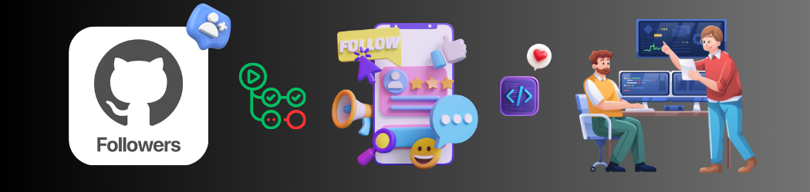

    
    
    
    

## About the app

### GitHub Followers

A utility app to supplement your GitHub profile by getting to know more about your followers.

Get a quick glance of all your followers in a simple, no-nonense list with a quick search of your username. If a follower profile peeks your interest, simply tap on them to get a detailed view of their profile to see what they're up to.

No time to keep up with all your followers? Simply add them to your favorites and view them all at a later time.

Oh, and don't worry. All viewable profile data are public and made available by GitHub and no data are stored on any third-party servers.

 ##### *Built in [Swift](https://developer.apple.com/swift/) & [UIKit](https://developer.apple.com/documentation/uikit), using the GitHub API to retrieve public profile data of followers with image caching for local data persistence and a MVC (Model-View-Controller) architectural design pattern. Available in both light & dark mode.*

    

    In-app screenshots in dark mode.

## Concepts learned

    

## Credits

##### Swift, UIKit, Xcode, SF Symbols, Cocoa Touch, Safari, App Store, iPhone & iOS, iPad & iPadOS, Apple Watch & watchOS, Apple TV & tvOS, Mac & macOS and their logos are trademarks of Apple Inc., registered in the U.S. and other countries.

